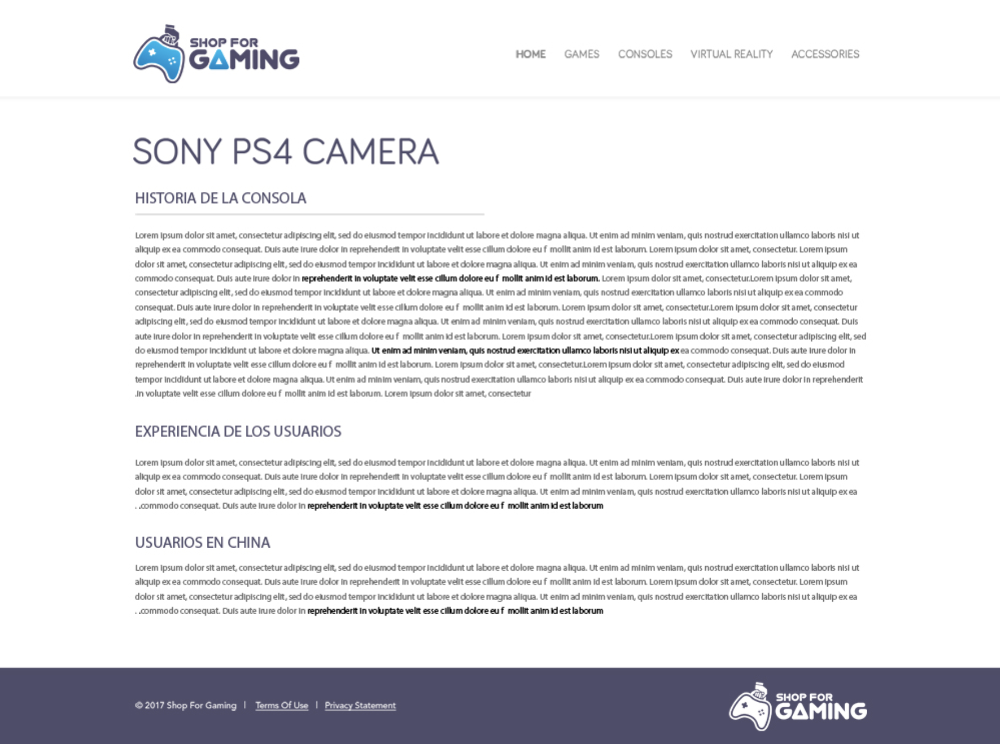

# Ejercicio / Desafío

## Crear un sketch en papel con un mínimo de 3 opciones en su menú principal:

   - Contenido principal.
   - Pie de página.
   - Secciones y articulos.

## Construir el esqueleto de una WEB semánticamente correcta

   - Utilizar las etiquetas vistas según corresponda, intentando reproducir la estructura del mockup de ejemplo. Y utilizando información del siguiente articulo: https://es.wikipedia.org/wiki/PlayStation_4

