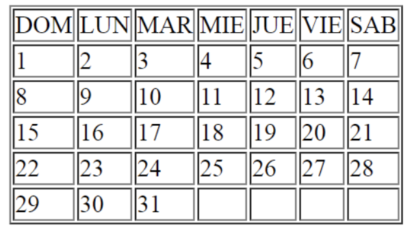

# Crear una págima que tenga los siguientes componentes

## Una lista

   - Debe mostrar el ranking de tus 5 películas favoritas

## Una tabla

   - La tabla debe ser como la siguiente imagen
      * 

## Una imagen

   - La imgen tiene que llevar al sitio de coderhouse al hacer click en ella. 
      * `https://www.coderhouse.com/`
      * 

## Un formulario

   - Debe pedir los siguientes campos:
      - Usuario (Input)
      - Password (Input)
      - Género (Radio)
         - Masculino
         - Femenino
      - País (Select)
         - Argentina
         - México
         - Uruguay
         - Chile
    - Debe tener dos botones:
       - Limpiar el formulario
       - Mandar el formulario, tipo botón normal

