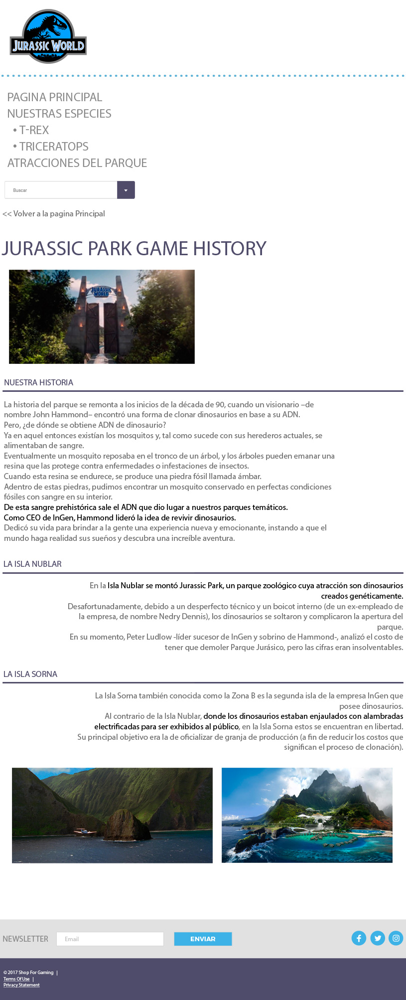

# Desafío

- Maquetar el siguiente mockup en un documento usando HTML5, insertando un documento CSS externo, utilizando las propiedades explicadas hasta el momento e intentando reproducir lo más fiel el diseño 

